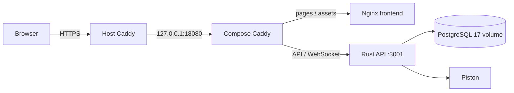
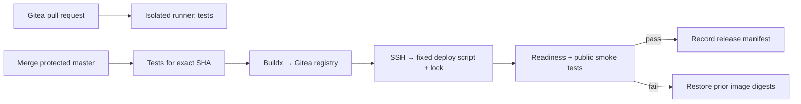

# ShareCode CI/CD 调研与部署记录

调研日期：2026-09-08。用户已明确不采用 GitHub。建议使用 **现有 Gitea + Gitea Actions / act_runner + Gitea Container Registry + SSH + Docker Compose**：在独立构建机上测试并构建镜像，DMIT 服务器只拉取经过验证的镜像并切换应用容器。继续使用现有 Caddy 和 PostgreSQL，无需引入 Kubernetes。生产发布不依赖 GitHub、GHCR 或 GitHub 托管的 actions 下载。

本文件是基于实际服务器检查的设计方案，尚未安装 runner、配置 Gitea secrets、添加激活中的 workflow 或修改旧 Git hook。Gitea 的实际版本、Actions / Packages 开关、runner 和备份情况仍需核实。本轮从本机请求公开 `/api/v1/version` 时 TLS 连接提前结束，未能取得实例版本；这不能证明服务对其他网络也不可用。

## 1. 已核实的基础设施

| 项目 | 现状 |
| --- | --- |
| 公网入口 | `https://collabcode.cc`，`www` 重定向到主域名 |
| SSH | 本机 alias `dmit-us`，当前以 root 登录 |
| 宿主机 | Linux，约 4 GiB 内存、1 GiB swap；检查时磁盘约 40 GiB 可用 |
| HTTPS | systemd 管理的宿主 Caddy，配置 `/etc/caddy/Caddyfile` |
| 应用入口 | 宿主 Caddy → `127.0.0.1:18080` → Compose 内的 Caddy |
| Compose 项目 | `sharecodework` |
| 生产源码目录 | `/root/sharecode.work` |
| 生产 Compose | `/root/sharecode.work/docker-compose.production.yml` |
| 生产环境变量 | `/root/sharecode.work/.env.production`，留在服务器上 |
| 容器 Caddy 配置 | `/root/sharecode.work/Caddyfile.production`，`:80` 明文 HTTP，由宿主层终止 TLS |
| 前端 | `sharecodework-frontend` 镜像，Nginx 提供 Vite 构建产物 |
| API / WebSocket | `sharecodework-server` 镜像，Rust/Axum，容器内 `3001`，`/api/*` 和 `/api/ws` |
| 数据库 | PostgreSQL **17**，volume `sharecodework_pgdata` |
| 代码执行 | 独立 Piston 容器；纯前端更新无需重启它 |
| 其他服务 | 此宿主同时承载其他应用，发布应限定 Compose 项目和服务 |
| 现有 Gitea remote | `git@git.fisherboy.cc:fisherboy/sharecode.git`，拟作为唯一发布来源 |
| Gitea CI 状态 | 尚未核实实例版本、Actions 配置、runner 注册和分支保护 |
| 历史 GitHub remote | 用户已排除其参与 CI/CD；此前检查结果仅作版本对照 |



### 现有自动发布入口及版本漂移

`/root/sharecode.git/hooks/post-receive` 监听 `refs/heads/master`，执行：

```bash
git --work-tree="$WORK_TREE" --git-dir="$REPO_DIR" checkout -f master
docker compose -f docker-compose.production.yml --env-file .env.production up --build -d
```

这已经是一个简易自动部署入口，但没有前置 CI、版本化镜像、发布互斥、健康检查或回滚。它在生产宿主构建整套服务。

检查时的版本：

- 本地 HEAD 和服务器 bare 仓库 master：`9b64d70da8db95f4303c27331525df5fef204072`。
- GitHub master：`89322daea8d04d2c81a4f73ea87df02c89611c5b`。
- `/root/sharecode.work/.git` HEAD：`9ebc6e80e57adfba1a43f6e9ef724ae23cb37134`。

Hook 通过另一个 bare 仓库操作工作目录，使目录内 `.git` 所见的版本与实际文件不一致。逐文件 SHA-256 对比确认：本次发布前，服务器的全部已跟踪 Rust 源码与本地一致，前端差异集中在当前本地改进和字体许可证文件。不能用线上工作目录的 `git status` 判断真实发布内容。

引入正式 CD 前应将验证过的应用改动整理成提交，推送到唯一权威来源（现有 Gitea 的受保护发布分支，以下暂按 `master` 设计，启用前核实）。其他远端不要同时成为自动生产发布入口。

## 2. 本次发布

- 发布 ID：`20260908-math-130850`。
- 来源：本地已测试工作树，基于 `9b64d70`，包含尚未提交的前端改动；不能将它标记为该 commit 的纯净构建。
- 镜像：`sharecode-frontend:20260908-math-130850`。
- 旧镜像保留为：`sharecode-frontend:rollback-20260908-math-130850`。
- 发布目录：`/root/sharecode-releases/20260908-math-130850`。
- 内容记录：`manifest.json`（125 个源文件的 SHA-256）、`build.log`、`candidate-image-id`、成功后生成的 `deployed.json`。
- 备份：`backup/frontend-source.tar.gz`、生产 Compose/Caddy 配置、旧镜像 ID 和其他容器 ID。
- 构建参数沿用生产配置：API / WS URL 为空，使用同源请求；注册 UI 为 `false`。
- 发布范围：当前本地前端，包括数学公式、Markdown 回放、分享链接复制等已有工作树改进。后端源码一致，因此无需发布 API 或运行数据库迁移。

构建先使用隔离的源码目录和候选镜像，再启动临时容器检查 Nginx、公式代码、翻译、字体和入口 HTML。切换时将已验证镜像标记为现有 Compose 使用的镜像名，仅重建 `frontend`。验证首页与候选 HTML 完全一致、API 返回预期的未登录 `401`，并确认 API、数据库、Caddy、Piston 容器 ID 没有变化。成功后才同步前端源码到现有构建目录。

如果需要立即回滚前端运行镜像：

```bash
ssh dmit-us
cd /root/sharecode.work
docker image tag sharecode-frontend:rollback-20260908-math-130850 sharecodework-frontend
docker compose -f docker-compose.production.yml --env-file .env.production \
  up -d --no-deps --no-build frontend
```

这只回滚运行镜像，源码仍是新版本；如要随后继续从源码构建，还需从备份恢复前端目录，并处理本次新增的文件。不要执行 `down -v` 或删除数据库 volume。下一版正式部署脚本应把“运行版本”和“源码目录”解耦，直接使用镜像 digest。

## 3. 自托管方案比较

| 方案 | 优点 | 代价 / 限制 | 建议 |
| --- | --- | --- | --- |
| Gitea Actions + 内置 Container Registry + SSH | 复用已有 Git 服务，源码、测试状态和镜像集中管理；一个 CI 系统 | 需独立部署 act_runner；workflow 兼容性取决于 Gitea / runner 版本 | **首选，先核实当前实例** |
| Gitea + Woodpecker CI + registry + SSH | 容器化 pipeline，CI 调度与 Git 服务分开 | 多维护一个 CI 服务及 OAuth/webhook 集成；本轮未深入验证其配置 | 希望 CI 独立于 Git 服务时的备选 |
| Git hook + 独立构建机 + SSH | 组件少，脚本直接 | 需自行实现任务队列、日志、状态反馈、重试和凭证隔离 | 简单过渡方案 |

建议部署一个独立构建 VM，不把通用 runner 放在 DMIT 生产宿主，也不把 Git 服务、CI 构建和生产数据库都放在同一台机器。Docker socket / docker group 权限实质上等同于宿主 root。独立 VM 的维护成本是自托管方案的一部分；自托管本身不保证高可用。

## 4. 推荐的正式 workflow 划分

Workflow 放在 `.gitea/workflows/`。测试、构建、发布逻辑尽量写成仓库内脚本，YAML 只负责调度，便于本地执行和更换 CI。不要直接复制 GitHub 的 `environment`、token scopes 或缓存配置：官方兼容性文档明确列出了差异，最终以实际安装版本验证为准。

### `ci.yml`：PR 校验

触发 `pull_request`，只测试，不提供 registry 写入权限和生产部署凭证。保护发布分支，并要求对应 commit 的检查通过。PR job 与发布 job 的凭证必须隔离；不能仅凭 runner label 认定它是授权边界。

| Job | 校验内容 |
| --- | --- |
| Frontend | 固定 Node 和 Bun 版本；`bun install --frozen-lockfile`；`bun run build`；安装 Playwright Chromium；`node --test tests/markdown-math.test.mjs` |
| Backend | 对齐 Dockerfile 的 Rust 1.94；`cargo test --locked`；`cargo fmt --check`；`cargo clippy --locked --all-targets -- -D warnings` |
| Integration | 使用临时 PostgreSQL 17；启动 API、验证 migrations 和登录/房间/权限；双客户端 Yjs 同步及回放 |
| Container | 实际构建两个 Dockerfile，验证最终镜像能启动；前端使用生产同源构建参数 |

实施前需要先修复两项测试基线：仓库虽然有 `bun run lint` 命令，但没有已跟踪的 ESLint 配置，不能直接视为可用 CI gate；Rust fmt/clippy 也需要先运行确认现有基线。当前新增的 8 项 math 浏览器测试已经通过，覆盖输入、粘贴、只读、序列化、并发同步和错误公式；这不等于已有完整应用集成测试。

Integration 测试使用专用临时数据库和测试账号，不能复用生产 JWT、数据库凭证或访问真实用户房间。Markdown 验证无需启动 Piston。

### `release.yml`：测试、构建、发布同一个 commit

推荐合并到 `master` 后自动执行，同一个 workflow 内使用明确的 job 依赖链：测试 → 构建 → 发布。PR 和发布复用仓库脚本，避免依赖尚未验证兼容性的 reusable workflow 或跨 workflow 成功事件。

1. 从 Gitea checkout 触发事件对应的 commit SHA，运行完整 CI，不能直接用移动的分支 tip 替代它。
2. 用 Buildx CLI 分别构建 frontend 和 server。候选镜像地址为 `git.fisherboy.cc/fisherboy/sharecode-frontend` / `sharecode-server`，需先确认该实例已启用 Packages、支持镜像上传且存储空间足够。
3. 用 commit SHA 作标签，记录 registry 返回的 `@sha256:...` digest。发布 manifest 包含两个镜像 digest 和 source SHA。初期每次构建一对镜像，优先确保版本一致。
4. 发布仅接受受保护 master 的已验证版本。Gitea 官方文档注明 `jobs.<job_id>.environment` 被忽略，不能用 `environment: production` 当作审批、分支限制或 secret 隔离机制。实际权限需由实例版本支持的配置、受保护分支和部署入口共同落实。
5. 服务器端使用 `flock`，让自动部署、人工发布和回滚共用同一把锁；获得锁后复核发布版本是否已过期。即使安装版本支持 workflow concurrency，它也只是辅助机制。
6. SSH 调用固定的受限部署脚本，传入 release manifest。验证镜像仓库白名单和 digest 格式后，拉取镜像，再用固定 Compose 项目更新目标服务。
7. 验证 readiness、公网资源和 API；成功后写入 `current-release.json`，保留上一份 manifest。失败则恢复上一对 digest，并把失败返回给 CI。
8. 将构建日志、manifest 和测试报告保存到 Gitea 支持的 artifact 存储或自建对象存储；不能只保存在 runner 临时磁盘。



### `rollback.yml`：显式恢复已知版本

实际 Gitea / runner 版本支持手动触发和输入参数后，可通过 `workflow_dispatch` 输入历史 release ID；否则先保留受控的 SSH 手动入口。验证历史 manifest 和镜像白名单，复用相同服务器锁、部署脚本和 smoke test，不重新构建。数据库兼容性是回滚前提，不能把镜像回滚等同于数据库回滚。

### 消除隐含的 GitHub 运行时依赖

- Gitea 默认可能从 GitHub 下载 `uses: actions/...`。优先使用 `run:` 调用仓库脚本和预装 CLI；需要 action 时，镜像到自家 Gitea 并使用完整自托管 URL 和固定 commit SHA。可结合实例的 `DEFAULT_ACTIONS_URL=self`，但仍需核实镜像 action 的代码是否继续下载 GitHub 文件。
- 使用自己构建的 runner job 镜像，预装 git、Node、Bun、Rust、Docker Buildx 和所需浏览器。将工具和基础镜像同步到可控仓库，避免每次 job 临时下载 release binaries。
- 使用自建 registry cache 或持久 BuildKit 缓存，不使用 `type=gha`；不使用 GHCR 和依赖 GitHub OIDC 的签名流程。
- npm、crates.io、Docker Hub、Playwright 下载源仍是外部依赖。若目标是网络抖动时仍可构建，逐步配置包代理、基础镜像镜像和浏览器缓存。工具引导与依赖来源需实际审计，不能仅换 CI 平台就宣称完全独立。

## 5. 部署侧设计细节

### Compose、配置和发布身份

- 引入专用的生产镜像 Compose 定义，让 `frontend.image` 和 `server.image` 从 release manifest 生成的环境文件取值；生产部署不再依赖 `build:`。
- 显式保持 `-p sharecodework`。随意改项目名会创建另一套默认命名的网络/volume，可能看起来像数据库丢失。
- 保留 PostgreSQL **17** 和 `sharecodework_pgdata`。本地旧 `docker-compose.production.yml` 模板仍写 PostgreSQL 16、公开 80/443，并使用通用 Caddyfile，不能直接覆盖这台机器的生产配置。
- 保留宿主 Caddy → `127.0.0.1:18080` 的入口；不改动宿主其他站点。
- 使用单独的部署 SSH key，固定 known_hosts 指纹；不要用 `StrictHostKeyChecking=no`。本机的 `dmit-us` alias 不会自动出现在 runner job，需显式配置 host、port 和 user。
- 推荐部署用户通过受限 sudo 或 forced-command 运行 root 拥有、不可被该用户修改的固定脚本。脚本只接受验证过的镜像 digest / release ID，固定 Compose 路径，不接受任意 shell 或任意 Compose 文件。单纯加入 docker group 并不构成最小权限。
- `.env.production` 和运行凭证只保留在服务器；CI 仅保存构建和部署所需凭证。使用 Gitea 专用服务账号：构建侧可写 Packages，生产侧仅可读 Packages。官方兼容性文档提示自动 job token 的 package 授权有限制，先按实际版本验证；必要时使用最小权限 PAT，不假设自动 token 能推送镜像。
- PR job 不获取生产 secrets，也不能写可信发布缓存。按当前 Gitea 版本核对 job token 权限和 fork PR 行为；自托管 actions 固定完整 commit SHA，更新通过受审核的镜像同步流程。
- 切换到 Actions 自动部署时停用旧 post-receive 自动发布逻辑，避免两个入口竞争；保留 bare Git 仓库作为备份本身没有问题。

### 健康检查和回滚

当前 Rust `/health` 返回静态 `{"status":"ok"}`，不能证明数据库可用；当前容器 Caddy 只把 `/api/*` 转发给 API，因此公网 `/health` 可能返回 SPA HTML。正式 CD 应提供真正的 `/api/health/ready`，执行轻量数据库查询，并明确检查 JSON 和状态码。

`docker compose up --wait` 只有在服务配置了 healthcheck 时才代表健康；否则仅说明容器 running。Rust 最终镜像目前没有 curl/wget，需要设计镜像内可执行的探测方式，或使用部署侧专门的探测容器。

生产 smoke test 至少包括：

- HTTPS 首页、指定的 JS/CSS/font 资源返回正确 MIME 和内容，release SHA/digest 与预期一致。
- `/api/health/ready` 返回预期 JSON；未登录 `/api/rooms` 返回 401，而不是代理的 HTML。
- 使用专用测试账号验证 WebSocket 协作；有写入的测试应使用专用测试房间，并制定清理方式。
- API、数据库、Caddy、Piston 非目标服务未被意外重建。

Rust 在启动时自动执行 SQLx migrations。初期单实例可保留，但需要在集成测试中验证全新库和前一版本库升级；正式发布时记录 migration 版本。有破坏性的 migration 不能靠切回旧镜像恢复。采用 expand/contract 的兼容迁移；数据库备份、异地保存和恢复演练独立设计。全量数据库恢复应是明确的数据恢复操作，不能作为失败发布的自动动作。

当前 Compose 单实例替换不是零停机发布。仅前端更新不会重启 API/WebSocket；更新 API 会使已有 WebSocket 重连。若以后要求零停机，应设计双槽部署、代理切换、连接 draining，以及 Yjs 多实例状态协调，不能只增加副本数。

前端还需要考虑旧页面在发布后加载旧的 lazy chunk：建议保留前一版静态资源一段时间，或增加版本检测与可恢复的 chunk 加载失败处理。本次未修改该机制。

### 缓存与可追溯性

- 使用 Bun frozen lockfile 和 `cargo --locked`，固定构建工具版本；当前 Dockerfile 的 Bun 是 1.3.11，应让 CI 对齐。
- 两个镜像分别使用 registry cache ref（例如 `sharecode-frontend-cache:master` / `sharecode-server-cache:master`），避免缓存相互覆盖。
- 使用 `--cache-to type=registry,ref=<cache-image>,mode=max`和对应 `--cache-from` 缓存镜像层；使用支持该缓存后端的 Buildx driver。Dockerfile 内 cache mount 的下载缓存单独依赖 BuildKit 持久数据或额外导入导出，不把 registry 层缓存等同于下载缓存。可信构建和不可信 PR 隔离，定期 GC。
- 镜像附带 source revision label、SBOM 和 provenance；如需签名，选用自管密钥或自己的身份服务，而非 GitHub OIDC。最终 manifest 记录 commit、digest、构建链接、迁移版本、时间和上一版 release。
- 不使用可变 `latest` 作为回滚依据；镜像清理保留当前、上一版及有限数量历史版本。

## 6. 建议实施顺序

1. 核实 `git.fisherboy.cc` 实际 Gitea 版本、Actions / Packages 配置、磁盘、备份与网络；选择独立 runner VM。决定先配置包缓存到什么程度。
2. 整理并提交当前应用改动，统一 Gitea 受保护 master 为发布来源，消除线上源码与 Git 元数据混用。合并前对照 Gitea 当前分支，保留其独有提交。
3. 修复 lint/fmt 基线，落地 `.gitea/workflows/ci.yml`，将构建和测试设为必需检查。
4. 新建镜像生产 Compose、release manifest 和受限部署脚本；添加 readiness endpoint；在隔离 staging 上演练成功部署和失败回滚。
5. 配置受限发布身份、部署 key/known_hosts、Gitea registry 凭证和自建缓存；添加 `release.yml` / `rollback.yml`，验证 job 依赖和凭证隔离。
6. 停用旧 hook 的自动发布段，开启 Gitea master 合并后自动发布。
7. 备份 Gitea 的仓库、数据库、配置和 Packages 存储；另行备份生产数据库并验证恢复。runner 离线应使发布排队或失败，registry 离线不应停止当前运行版本。

## 7. 官方资料

- [Gitea Actions 概览](https://docs.gitea.com/usage/actions/overview) — 内置 CI 和独立 runner 的职责。
- [Gitea Container Registry](https://docs.gitea.com/usage/packages/container) — OCI 镜像、认证和镜像地址格式。
- [Gitea Actions 兼容性](https://docs.gitea.com/usage/actions/comparison) — environment、token、action 来源等差异；落地前按实例版本复核。
- [Gitea Act Runner](https://docs.gitea.com/next/usage/actions/act-runner) — runner 模式及 Docker socket 权限边界；此链接为 next 文档，落地时切到实际版本。
- [Docker Registry Cache](https://docs.docker.com/build/cache/backends/registry/) — 无需 GitHub 的 BuildKit registry 缓存。
- [Docker Compose 生产部署](https://docs.docker.com/compose/how-tos/production/) — 单机部署、环境差异、按服务重建。
